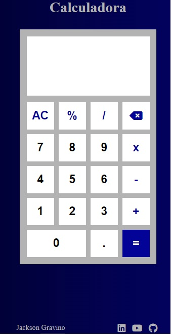

# calculadora

## Sobre

Esse projeto foi feito com o uma forma de aprimorar minhas abilidades em JavaScript criando uma calculadora

## Características

calculadora simples e prática, para uso cotidiano

## Tecnologias usadas

- [HTML]
- [CSS]
- [JavaScript]

### Tela

  

---

Feito por Jackson Gravino
